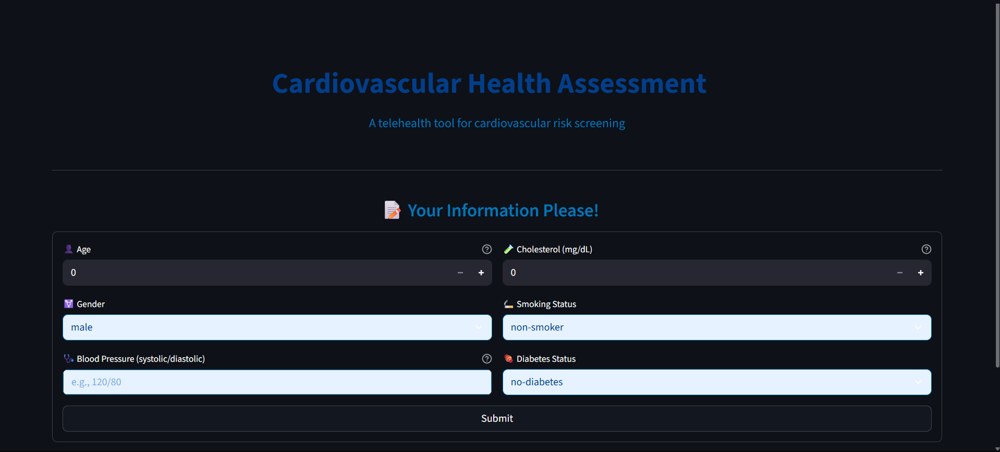
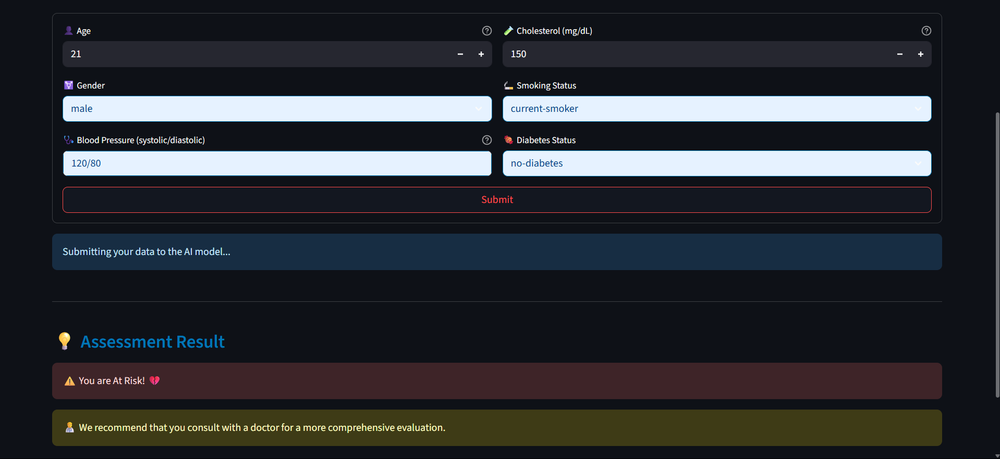
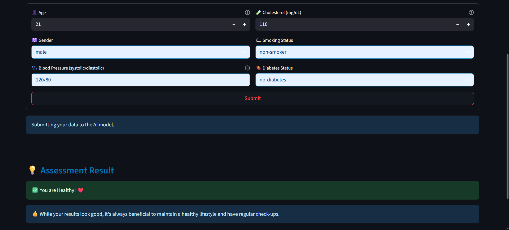

# Cardiovascular Health Assessment (Streamlit + Gemini API)

This app allows users to input their health data and receive an AI-powered cardiovascular risk assessment using Google's Gemini API.

## Live Demo

[Try the app live here!](https://cardiovascular-health-assessment-dpifmxej864kzqcn5tkrhx.streamlit.app/)

## Features
- Collects user health data via a Streamlit web form
- Sends data to Gemini API for risk assessment (no local calculation)
- Displays results and recommendations

## Demo

Below are some screenshots of the app in action:

### Home Page


### User With Risk


### User Without Risk


## Setup

1. **Clone the repository**
2. **Install dependencies**

```bash
pip install -r requirements.txt
```

3. **Set up your Gemini API key**

Create a `.env` file in the project root:

```
GEMINI_API_KEY=your-gemini-api-key-here
```

4. **Run the app**

```bash
streamlit run app.py
```

5. **Open your browser**

Go to [http://localhost:8501](http://localhost:8501) to use the app.

## Notes
- You must have a valid Gemini API key from Google.
- All risk assessment is performed by the Gemini model, not locally. 
